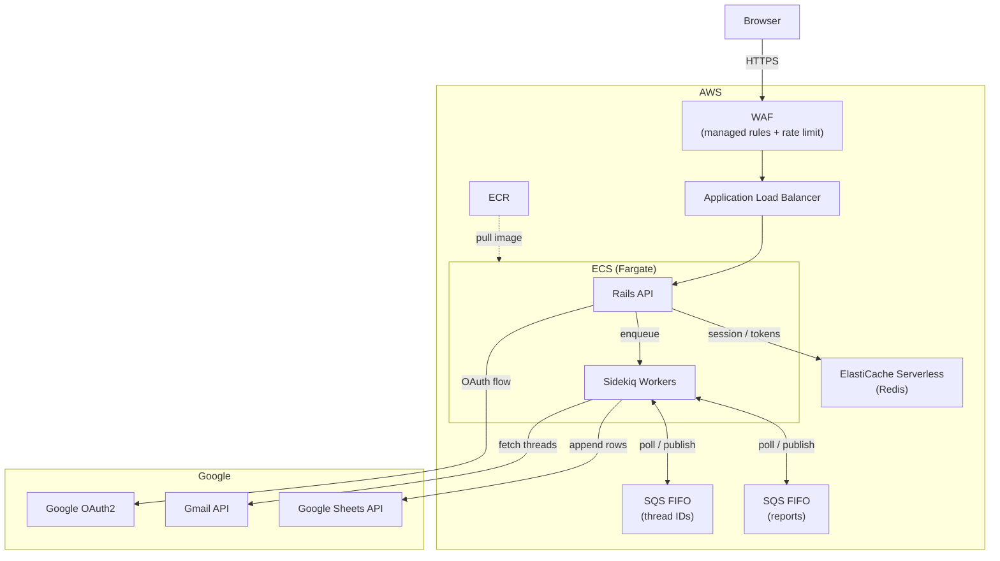
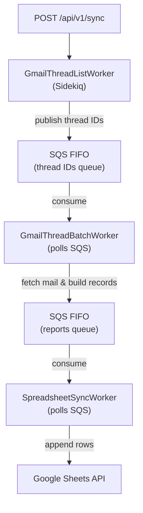

# damage-report-plots-v2

[&replace=%241&label=Ruby&logo=ruby&logoColor=white&color=CC342D)](apps/api/.ruby-version)

## Architecture

### System Overview

```mermaid
graph TB
    Browser["Browser"]

    subgraph AWS
        WAF["WAF\n(managed rules + rate limit)"]
        ALB["Application Load Balancer"]
        subgraph ECS["ECS (Fargate)"]
            API["Rails API"]
            Workers["Sidekiq Workers"]
        end
        Redis["ElastiCache Serverless\n(Redis)"]
        SQS1["SQS FIFO\n(thread IDs)"]
        SQS2["SQS FIFO\n(reports)"]
        ECR["ECR"]
    end

    subgraph Google
        OAuth["Google OAuth2"]
        Gmail["Gmail API"]
        Sheets["Google Sheets API"]
    end

    Browser -->|HTTPS| WAF
    WAF --> ALB
    ALB --> API
    API -->|session / tokens| Redis
    API -->|enqueue| Workers
    Workers <-->|poll / publish| SQS1
    Workers <-->|poll / publish| SQS2
    API -->|OAuth flow| OAuth
    Workers -->|fetch threads| Gmail
    Workers -->|append rows| Sheets
    ECR -.->|pull image| ECS
```

### Worker Pipeline

```mermaid
graph TD
    Sync["POST /api/v1/sync"]
    W1["GmailThreadListWorker\n(Sidekiq)"]
    Q1["SQS FIFO\n(thread IDs queue)"]
    W2["GmailThreadBatchWorker\n(polls SQS)"]
    Q2["SQS FIFO\n(reports queue)"]
    W3["SpreadsheetSyncWorker\n(polls SQS)"]
    Sheets["Google Sheets API"]

    Sync --> W1
    W1 -->|publish thread IDs| Q1
    Q1 -->|consume| W2
    W2 -->|fetch mail & build records| Q2
    Q2 -->|consume| W3
    W3 -->|append rows| Sheets
```
