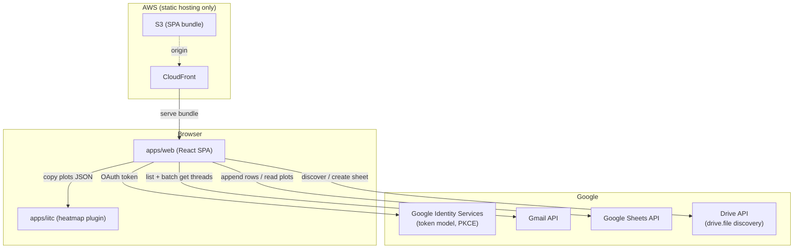
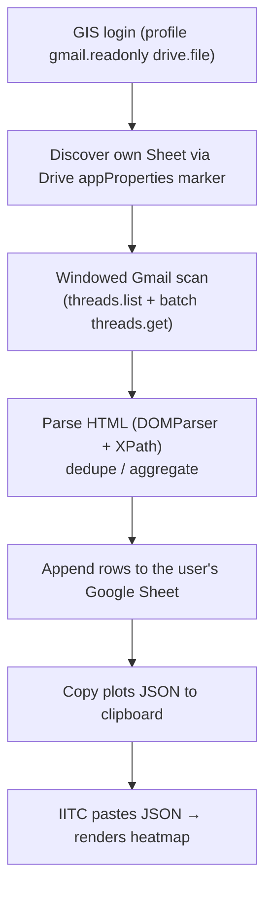

# damage-report-plots-v2

## Architecture

The pipeline runs **entirely in the browser**: the SPA talks to Google directly
(GIS token model, PKCE, no client secret) and no Gmail data ever reaches a
server. This avoids the CASA restricted-scope security assessment — the backend
that formerly ran the sync (ALB / ECS / Sidekiq / SQS / ElastiCache) has been
decommissioned, and only static hosting (S3 + CloudFront) remains.

### System Overview

### In-browser sync flow

- **`apps/web`** — React SPA: auth, in-browser Gmail sync, Sheet write, and
  "Copy plots JSON" to the clipboard.
- **`apps/iitc`** — IITC plugin: pastes the plots JSON and renders the heatmap.
